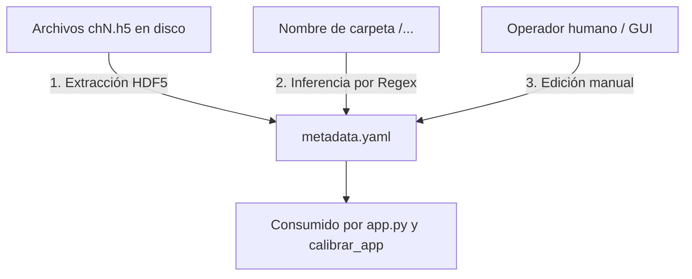
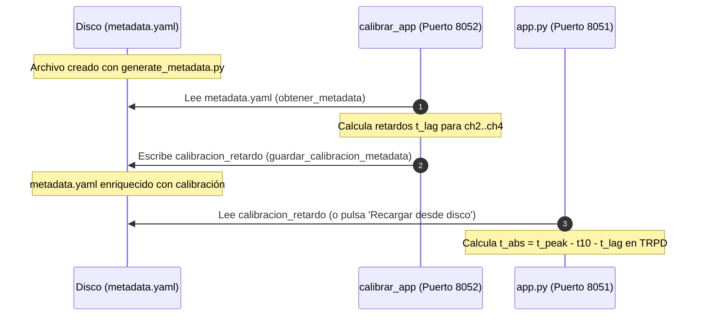

# Guía de Referencia: `metadata.yaml`, Probetas y `generate_metadata.py`

Esta guía documenta la convención de nomenclatura de carpetas de mediciones y probetas, el esquema completo de `metadata.yaml`, el uso de la herramienta `generate_metadata.py`, las reglas de obligatoriedad del archivo y el flujo coordinado de trabajo entre **TRPD_APP** (`app.py`, puerto 8051) y el calibrador instrumental (**`calibrar_app`**, puerto 8052).

---

## 1. Convención de nombres de carpetas y códigos de probeta

Las mediciones residen en el directorio de almacenamiento `Mediciones/` (normalmente ubicado en `../mediciones/Mediciones` respecto al repositorio) y siguen la jerarquía unificada v2:

```
<mediciones>/
  3v_2mm3mm3.5mm_0/        <- carpeta principal: {N}v[H]_{d1}mm{d2}mm..._{set}
    10kV/                  <- nivel de tensión (secundario del transformador)
      ch1.h5 ch2.h5 ... metadata.yaml
    11kV/
```

### 1.1 Estructura de la carpeta principal (`{N}v[H]_{d1}mm{d2}mm..._{set}`)
- **`{N}v`:** Número de cavidades o vacuolas (ej. `1v`, `2v`, `3v`).
- **Sufijo opcional `H`:** Situado inmediatamente tras la `v` (ej. `3VH_...`, insensible a mayúsculas); indica vacuolas en distintas capas o alturas relativas (`tipo_geometria: "asimetrica"`).
- **Diámetros concatenados:** Secuencia de diámetros en milímetros (ej. `2mm3mm3.5mm` -> `[2, 3, 3.5]`, admiten decimales).
- **Último token `_{set}`:** Número entero (`0`, `1`, `12`...) que identifica el set de impulsos con esas características constructivas.

### 1.2 Subcarpeta de nivel de tensión (`{X}kV`)
- Contiene los archivos binarios HDF5 (`ch1.h5`..`ch4.h5`) y `metadata.yaml`.
- El nombre `{X}kV` (p. ej. `10kV`, `17.5kV`) representa la tensión del secundario del transformador de impulso y se asigna automáticamente a `circuito_impulso.tension_kv_ac_sec`.

### 1.3 Clasificación automática de geometría
- **Con sufijo `H`:** `tipo_geometria = "asimetrica"`.
- **Sin sufijo `H`:** Se deriva directamente de la lista de diámetros:
  - Si todos los diámetros son iguales: `tipo_geometria = "monodiametro"`.
  - Si existen diámetros diferentes: `tipo_geometria = "mixta"`.

**Ejemplos representativos:**
- `3v_2mm3mm3.5mm_0/10kV/`: 3 vacuolas mixtas en la misma capa, set 0, tensión secundario 10 kV.
- `3VH_2mm3mm3.5mm_0/11kV/`: 3 vacuolas en configuración asimétrica (distintas capas), set 0, 11 kV.
- `1v_2mm_1/17.5kV/`: 1 vacuola monodiámetro de 2 mm, set 1, 17.5 kV.
- `2v_3mm3mm_12/15kV/`: 2 vacuolas monodiámetro de 3 mm, set 12, 15 kV.

### 1.4 Descubrimiento de mediciones y ubicación de archivos
- **Ubicación de `metadata.yaml`:** Reside directamente en la raíz de la carpeta de la medición, al mismo nivel que los archivos binarios HDF5 (`ch1.h5`, `ch2.h5`, `ch3.h5`, `ch4.h5`). No debe ubicarse dentro de subcarpetas.
- **Criterio de selección:** Las mediciones se eligen con el explorador de carpetas de `app.py` o `calibrar_app` (no hay carpeta de datos fija). El botón "Seleccionar esta carpeta" se habilita si la carpeta contiene **al menos un archivo** que cumpla el patrón `*ch[1-4]*.h5`. No es obligatorio que existan los 4 canales ni que exista previamente `metadata.yaml`.

---

## 2. Plantilla vacía de `metadata.yaml`

El archivo `metadata.yaml` contiene la parametrización física, instrumental y de calibración de un ensayo. A continuación se presenta la plantilla generada por `plantilla_metadata()` (`generate_metadata.py`), con los valores iniciales y por defecto del sistema:

```yaml
experimento:
  id: <principal>/<XkV>                # Ruta relativa <carpeta_principal>/<XkV>
  fecha_hora: null                     # Única fecha: Frame/TheFrame.Date del .h5 de CH1 (≈ fin de adquisición), 'YYYY-MM-DD HH:MM:SS'
  temperatura_c: null                  # Temperatura ambiente del laboratorio (°C)
  humedad_relativa_pct: null           # Humedad relativa del laboratorio (%)

circuito_impulso:
  forma_onda_nominal: 1.2/50us         # Impulso tipo rayo normalizado IEC 60060-1
  tension_kv_ac_sec: null              # Tensión en secundario (kV, inferida automáticamente de la subcarpeta <X>kV)
  nro_disparos_programados: 50         # Segmentos configurados (leído de NumSegments en .h5)
  intervalo_entre_disparos_s: 30.0

probeta:
  codigo: ''                           # Código de la probeta (inferido de la carpeta principal)
  tipo_geometria: ''                   # monodiametro / mixta / asimetrica
  descripcion: Pressboard sumergido en aceite mineral
  nro_capas_total: 4
  espesor_capa_mm: 0.48
  nro_vacuolas: null                   # Número de cavidades (inferido de {N}v)
  diametros: []                        # Lista de diámetros en mm (ej. [2, 3, 3.5])
  set_impulsos: null                   # Set de impulsos (inferido de _{set})
  vacuolas: []                         # Lista de detalles: {id: 1, diametro_mm: 2, capa: 2}
  distancias_entre_vacuolas_mm: []
  fotos: []

osciloscopio:
  modelo: DSOS804A
  serial: null                         # Serial instrumental extraído de los metadatos HDF5
  frecuencia_muestreo_gsas: null       # Frecuencia en GSa/s (ej. 5.0)
  tiempo_total_ventana_us: null        # Ventana total adquirida en µs (ej. 200.0)
  escala_tiempo_us_div: null           # Base de tiempo (µs/div)
  num_segmentos_capturados: null       # Segmentos leídos en el archivo HDF5
  puntos_por_segmento: null            # Muestras por segmento (ej. 1000003)

trigger:
  canal_origen: ch1                    # Siempre CH1 (montaje fijo)
  tipo: flanco
  pendiente: positiva                  # Polaridad positiva constante o leída de HDF5
  nivel_v: null                        # Medido: mediana de CH1 en t = 0 (.h5)
  posicion_horizontal_pct: 10.0        # XDispOrigin / XDispRange del .h5
  nivel_v_fuente: null
  pretrigger_us: null                  # -XDispOrigin del .h5
  jitter_trigger_ns: null              # Dispersión de SegmentedXOrg entre segmentos
  flanco_ch1_en_t0: null               # Verificación: CH1 está en su flanco en t = 0

canales:
  ch1:
    sensor: Divisor capacitivo
    funcion: Tension LI / Sincronismo
    unidad: kV
    atenuacion_db: 0
    escala_v_div: null                 # Escala vertical leída del archivo HDF5
    offset_v: null
    rango_total_v: null
  ch2:
    sensor: HFCT
    funcion: Corriente PD
    unidad: V
    atenuacion_db: 30
    escala_v_div: null
    offset_v: null
    rango_total_v: null
  ch3:
    sensor: Antena Vivaldi
    funcion: UHF Banda ancha
    unidad: V
    filtro: ninguno
    escala_v_div: null
    offset_v: null
    rango_total_v: null
  ch4:
    sensor: Antena Bioinspirada
    funcion: UHF / Resolucion picos frente
    unidad: V
    filtro: HP_200MHz
    escala_v_div: null
    offset_v: null
    rango_total_v: null
```

### Propósito de las secciones de nivel superior:
1. **`experimento`:** Identificador único de ruta y registro de condiciones termohigrométricas del laboratorio.
2. **`circuito_impulso`:** Parámetros operativos del generador Marx/impulso (tensión del secundario, cadencia).
3. **`probeta`:** Propiedades mecánicas y constructivas del espécimen de ensayo (pressboard, capas, dimensiones y cavidades).
4. **`osciloscopio`:** Metadatos de digitalización y base de tiempo del instrumento (Keysight Infiniium DSOS804A).
5. **`trigger`:** Configuración de sincronización del disparo de adquisición en el osciloscopio.
6. **`canales`:** Sensor físico, función asignada, atenuación y filtros de acondicionamiento para cada entrada analógica (`ch1`..`ch4`).

> [!NOTE]
> **Ausencia de `calibracion_retardo` en la plantilla:**
> La función `plantilla_metadata()` **nunca** genera ni incluye la sección `calibracion_retardo`. La ausencia de este bloque indica que la medición no ha sido calibrada instrumentalmente, lo cual equivale a un retardo de $0\text{ ns}$ en la alineación temporal de `app.py`. Esta sección es generada y añadida exclusivamente por la aplicación calibradora (`calibrar_app`).

---

## 3. Cómo se calcula y rellena la información

Existen tres mecanismos complementarios para poblar los campos de `metadata.yaml`:


```mermaid
flowchart TD
    A["Archivos chN.h5 en disco"] -->|"1. Extracción HDF5"| D["metadata.yaml"]
    B["Nombre de carpeta <ID_Probeta>/..."] -->|"2. Inferencia por Regex"| D
    C["Operador humano / GUI"] -->|"3. Edición manual"| D
    D --> E["Consumido por app.py y calibrar_app"]
```

### 3.1 Extracción automática desde los archivos HDF5 (`extraer_info_h5`)
Cuando los archivos `ch1.h5` a `ch4.h5` existen en la carpeta, `generate_metadata.py` lee directamente sus atributos HDF5 (`Infiniium_Header` y metadatos de canal):
- **Base temporal:** Frecuencia de muestreo (`XInc` $\rightarrow$ GSa/s), número de segmentos (`NumSegments`), puntos por segmento y duración de la ventana.
- **Instrumento:** Modelo del osciloscopio, número de serie y fecha de guardado del .h5 de CH1 (única fecha del experimento, en `experimento.fecha_hora`).
- **Canales:** Escala vertical (`YPerDiv`), offset de voltaje (`YOrg`) y rango total de cada canal.

### 3.2 Extracción automática desde el nombre de carpeta (`inferir_parametros`)
Aplica directamente según la nueva jerarquía (`<principal>/<XkV>`):
- **`codigo_probeta`:** Nombre completo de la carpeta principal (ej. `3v_2mm3mm3.5mm_0`).
- **`nro_vacuolas`:** Conteo de cavidades obtenido del prefijo `{N}v` (ej. `3`).
- **`asimetrica`:** `True` si contiene sufijo `H` (ej. `3VH_...`), `False` en caso contrario.
- **`tipo_geometria`:** `asimetrica` si tiene `H`; si no, `monodiametro` si todos los diámetros son iguales o `mixta` si son diferentes.
- **`diametros`:** Lista numérica de diámetros en milímetros (ej. `[2, 3, 3.5]`).
- **`set_impulsos`:** Número entero del set obtenido del sufijo `_{set}` (ej. `0`).
- **`tension_kv_ac_sec`:** Tensión del secundario en kV obtenida de la subcarpeta `{X}kV` (ej. `10.0`).

### 3.3 Relleno y ajuste manual
Los datos que no residen en el osciloscopio ni en la ruta deben ingresarse manualmente:
- **Detalle de diámetros:** En el campo `diametros`, se infiere la lista numérica desde el nombre de carpeta (`[2, 3, 3.5]`). Si se requiere edición posterior, puede ajustarse en formato estándar o mediante la interfaz.
- **Otros campos manuales típicos:** Condiciones ambientales (`temperatura_c`, `humedad_relativa_pct`), lista detallada de cavidades (`vacuolas: [{id: 1, diametro_mm: 2, capa: 2}]`) y distancias entre cavidades.
- **Vías de edición:**
  1. **Directa en disco:** Abriendo `metadata.yaml` con cualquier editor de texto.
  2. **Desde la GUI de `app.py`:** En la pestaña **Metadata**, existe un cuadro de edición de texto YAML crudo (`meta_yaml_text`) con el botón **"💾 Guardar cambios del texto YAML"**.
  3. **Casilla de diámetros (`app.py`, pestaña Metadata, tarjeta 🧪 Probeta):** campo `meta_input_diametros` con el botón **"💾 Diámetros"**. Acepta `2mm-2mm-3mm`, `2, 2, 3`, `2 2 3`, `2;2;3` o `2/2/3` (decimales con punto: `2.5`) y guarda el formato estándar en `probeta.diametros`, conservando el resto del YAML. Valida contra el número de vacuolas y tipo de geometría (`monodiametro` o `mixta`). Si `metadata.yaml` aún no existe, se escribe la plantilla completa con ese campo.

> [!IMPORTANT]
> En la pestaña **Metadata** de `app.py`, las tarjetas visuales superiores (*Experimento, Circuito de Impulso, Probeta, Osciloscopio* y tabla de canales) son de **solo lectura**, salvo la casilla de diámetros de la tarjeta Probeta. El resto de cambios manuales en la interfaz se realiza sobre el área de texto YAML crudo.

---

## 4. Uso de `generate_metadata.py`

El script [generate_metadata.py](file:///G:/Mi%20unidad/yo/usm/investigacion/proyectos/inv_pd_vac/TRPD_APP/generate_metadata.py) es la herramienta de línea de comandos (CLI) para inicializar plantillas enriquecidas.

### 4.1 Sintaxis de comando
Debe ejecutarse desde la raíz del proyecto utilizando el entorno virtual:

```powershell
.venv\Scripts\python.exe generate_metadata.py <carpeta_medicion | carpeta_raiz> [--completar | --forzar] [--sin-senales]
```

- Ruta absoluta (o relativa al directorio actual) a la carpeta de la medición. No hay carpeta de datos fija.
  - Si la carpeta no contiene `chN.h5`, se recorren sus subcarpetas y se procesan todas las mediciones encontradas.
- `--completar`: rellena solo los campos ausentes o vacíos de un `metadata.yaml` existente; conserva lo escrito a mano y `calibracion_retardo`. **Es la opción segura para actualizar metadatas ya calibradas.**
- `--sin-senales`: omite el análisis de señales (amplitudes, saturación, nivel de trigger); solo usa atributos de cabecera HDF5.

### 4.2 Comportamiento del flag `--forzar`
- **Sin opciones (comportamiento seguro):** Si el archivo `metadata.yaml` ya existe en la carpeta indicada, el script **no lo modifica** e imprime un aviso.
- **Con `--forzar`:** Sobrescribe el archivo **completamente** con una plantilla nueva regenerada desde los `.h5` y el nombre de la carpeta.
  
> [!CAUTION]
> El uso de `--forzar` destruye cualquier edición manual previa (condiciones ambientales, geometrías) y **elimina la sección `calibracion_retardo`** si había sido guardada previamente por `calibrar_app`. Utilice `--forzar` solo si necesita reiniciar completamente la metadata desde cero.

- **Manejo de errores:** Si la carpeta de medición especificada no existe en disco, el script lanza una excepción `FileNotFoundError`.

### 4.3 Momento de ejecución
El script debe ejecutarse inmediatamente después de transferir los archivos `.h5` desde el osciloscopio hacia la carpeta de almacenamiento de mediciones, y **siempre antes** de iniciar tareas de calibración en `calibrar_app`.

---

## 5. ¿Es obligatorio `metadata.yaml`?

**No, ninguna de las dos aplicaciones exige `metadata.yaml` de forma estricta para operar.**

Tanto `app.py` como `calibrar_app` extraen las trazas de tensión y corriente, detectan los picos de descargas parciales y computan los parámetros del impulso LI ($t_{10}$, $O_1$, $T_1$, $T_2$, $\beta'$) directamente desde los datos binarios `.h5`. Sin embargo, el comportamiento de las aplicaciones ante la ausencia de `metadata.yaml` es **asimétrico**:

| Aplicación | Comportamiento si `metadata.yaml` no existe | Persistencia en disco |
|---|---|---|
| **`app.py`** (8051) | Genera la plantilla completa **en memoria** (`plantilla_metadata`), infiriendo datos de los `.h5` y de la ruta. Muestra la etiqueta *"Autogenerado desde HDF5 (no guardado)"*. | **No escribe en disco automáticamente.** Solo persiste si el usuario presiona *"💾 Guardar metadata.yaml"* o *"Guardar cambios del texto YAML"*. |
| **`calibrar_app`** (8052) | Devuelve un diccionario vacío `{}`. No genera plantilla enriquecida en memoria. | **Escribe solo al calibrar.** Si el usuario presiona *"💾 Guardar YAML"*, crea el archivo conteniendo únicamente el bloque `calibracion_retardo`. |

---

## 6. Interrelación entre `app.py` y `calibrar_app`

### 6.1 Arquitectura desacoplada
`app.py` y `calibrar_app` son procesos independientes ejecutados en puertos distintos (8051 y 8052). **No comparten código ni memoria en tiempo de ejecución**. Cada aplicación posee sus propias rutinas para leer y escribir metadata (`obtener_metadata` y `guardar_metadata_archivo` existen de forma independiente en `app.py` y en `calibrar_app/datos.py`).

El único medio de sincronización y comunicación entre ambas es el archivo físico `metadata.yaml` en disco:


```mermaid
sequenceDiagram
    autonumber
    participant D as Disco (metadata.yaml)
    participant C as calibrar_app (Puerto 8052)
    participant A as app.py (Puerto 8051)

    Note over D: Archivo creado con generate_metadata.py
    C->>D: Lee metadata.yaml (obtener_metadata)
    Note over C: Calcula retardos t_lag para ch2..ch4
    C->>D: Escribe calibracion_retardo (guardar_calibracion_metadata)
    Note over D: metadata.yaml enriquecido con calibración
    A->>D: Lee calibracion_retardo (o pulsa 'Recargar desde disco')
    Note over A: Calcula t_abs = t_peak - t10 - t_lag en TRPD
```

### 6.2 Roles de lectura y escritura
- **`calibrar_app` es el productor de calibración:** Es la única aplicación autorizada para computar y persistir el bloque `calibracion_retardo`. Al presionar el botón **"💾 Guardar YAML"** en `calibrar_app`, la función `guardar_calibracion_metadata` (`calibrar_app/persistencia.py`):
  1. Carga el diccionario existente de `metadata.yaml`.
  2. Inserta o actualiza la clave `calibracion_retardo`.
  3. Reescribe el archivo en disco, **preservando íntegras** las demás secciones (`experimento`, `circuito_impulso`, `probeta`, `osciloscopio`, `canales`).
- **`app.py` es consumidor puro:** Lee la sección `calibracion_retardo` para corregir el desfase temporal de los pulsos en el scatter TRPD:
  $$t_{\text{abs}} = t_{\text{peak}} - t_{10,\text{seg}} - t_{\text{lag}}$$
  La interfaz de `app.py` cuenta con un botón **"🔄 Recargar desde disco"** para actualizar la calibración sin reiniciar el servidor Dash si el archivo fue modificado externamente por `calibrar_app`.

### 6.3 ⚠️ Trampa del orden de trabajo (crítica)
Si se ejecuta `calibrar_app` sobre una medición que aún **no tiene** `metadata.yaml` en disco, `calibrar_app` creará un archivo nuevo que contendrá **exclusivamente** la clave `calibracion_retardo`, perdiéndose la estructura enriquecida (`experimento`, `probeta`, etc.). Si posteriormente el usuario intenta crear esa estructura ejecutando `python generate_metadata.py <carpeta> --forzar`, el script **sobrescribirá todo el archivo y destruirá la calibración ya guardada**. Use `--completar` en su lugar: agrega la estructura enriquecida y conserva `calibracion_retardo`.

### 6.4 Flujo de trabajo estándar recomendado (4 pasos)
Para evitar pérdidas de información, siga siempre esta secuencia:

```text
[1. Adquisición]      Volcar los registros ch1.h5..ch4.h5 en la carpeta de medición.
       ↓
[2. Inicialización]   Ejecutar: python generate_metadata.py <carpeta_medicion>
                      (Crea la plantilla enriquecida extrayendo datos del .h5 y la ruta).
       ↓
[3. Parametrización]  Completar datos ambientales y de probeta manualmente
                      (desde editor de texto o en pestaña Metadata de app.py).
       ↓
[4. Calibración]      Abrir calibrar_app (8052), calcular retardo instrumental y
                      presionar "💾 Guardar YAML" (preserva todo y anexa calibracion_retardo).
```

### 6.5 Nota sobre discrepancia documental histórica
> [!NOTE]
> En [DOCUMENTACION.md](file:///G:/Mi%20unidad/yo/usm/investigacion/proyectos/inv_pd_vac/TRPD_APP/archivos_md/DOCUMENTACION.md#L288-L322) se describe un esquema de `calibracion_retardo` que agrupa los canales bajo una subclave `canales: {ch2: {...}}` con campos como `std_ns`, `n_puntos` y `medicion_origen`.
> 
> En la implementación real vigente ([generate_metadata.py](file:///G:/Mi%20unidad/yo/usm/investigacion/proyectos/inv_pd_vac/TRPD_APP/generate_metadata.py#L258-L313) y [calibrar_app/persistencia.py](file:///G:/Mi%20unidad/yo/usm/investigacion/proyectos/inv_pd_vac/TRPD_APP/calibrar_app/persistencia.py)), la estructura es plana para simplificar el acceso:
> - `referencia_impulso`: `"t10"` u `"origen_virtual_IEC60060"`.
> - `ancla`: Información técnica del ancla temporal.
> - `ch2`, `ch3`, `ch4`: Bloques directos conteniendo `t_lag_ns`, `sigma_ns`, `n_valid`, `n_total`, `umbral_mv`, `distancia_us` y `tmin_us`.

---

## 7. Ejemplos reales y comparativa

### 7.1 Ejemplo real de medición legada (`cada_30s/7/metadata.yaml`)
Medición histórica real almacenada en disco, donde el código de probeta fue rellenado manualmente y no posee bloque de calibración instrumental:

```yaml
experimento:
  id: cada_30s/7
  fecha_hora: '2026-09-10 11:31:11'
  temperatura_c: null
  humedad_relativa_pct: null
circuito_impulso:
  forma_onda_nominal: 1.2/50us
  tension_v_ac_prim: null
  tension_kv_ac_sec: null
  tension_dc_condensador_kv: null
  polaridad: positiva
  nro_disparos_programados: 50
  intervalo_entre_disparos_s: 30.0
probeta:
  codigo: '4v23354'
  tipo_geometria: 'Simétrica'
  descripcion: Pressboard sumergido en aceite mineral
  nro_capas_total: 4
  espesor_capa_mm: 0.48
  nro_vacuolas: null
  vacuolas: []
  distancias_entre_vacuolas_mm: []
  fotos: []
osciloscopio:
  modelo: DSOS804A
  serial: MY60060103
  frecuencia_muestreo_gsas: 5.0
  tiempo_total_ventana_us: 200.0
  escala_tiempo_us_div: 20.0
  num_segmentos_capturados: 50
  puntos_por_segmento: 1000003
trigger:
  canal_origen: ch1
  tipo: flanco
  pendiente: positiva
  nivel_v: null
  posicion_horizontal_pct: 10.0
canales:
  ch1:
    sensor: Divisor capacitivo
    funcion: Tension LI / Sincronismo
    unidad: kV
    atenuacion_db: 0
    escala_v_div: 1.0
    offset_v: 0.0
    rango_total_v: 8.0
  ch2:
    sensor: Antena 1
    funcion: UHF
    unidad: V
    atenuacion_db: 30
    escala_v_div: 0.5
    offset_v: 0.0
    rango_total_v: 4.0
  ch3:
    sensor: Antena 2
    funcion: UHF
    unidad: V
    filtro: ninguno
    escala_v_div: 0.5
    offset_v: 0.0
    rango_total_v: 4.0
  ch4:
    sensor: Antena 3
    funcion: UHF
    unidad: V
    filtro: HP_200MHz
    escala_v_div: 0.5
    offset_v: 0.0
    rango_total_v: 4.0
```

### 7.2 Estándar de la nueva jerarquía (`3v_2mm3mm3.5mm_0/10kV`)
Al procesar una medición bajo la nueva jerarquía, `generate_metadata.py` genera automáticamente:
- `experimento.id: "3v_2mm3mm3.5mm_0/10kV"`
- `circuito_impulso.tension_kv_ac_sec: 10.0`
- `probeta.codigo: "3v_2mm3mm3.5mm_0"`
- `probeta.tipo_geometria: "mixta"`
- `probeta.nro_vacuolas: 3`
- `probeta.diametros: [2, 3, 3.5]`
- `probeta.set_impulsos: 0`

Y al realizar la calibración con `calibrar_app`, se anexa de forma no destructiva:

```yaml
calibracion_retardo:
  fecha: '2026-09-15'
  fuente_calibracion: 3v_2mm3mm3.5mm_0/10kV
  criterio: primer_cruce_umbral
  referencia: t10_CH1_por_segmento
  referencia_impulso: t10
  ch2:
    sensor: HFCT
    t_lag_ns: 12.450
    sigma_ns: 0.320
    n_valid: 50
    n_total: 50
    umbral_mv: 15.0
    distancia_us: 0.05
    tmin_us: -2.0
  ch3:
    sensor: Antena Vivaldi
    t_lag_ns: 8.120
    sigma_ns: 0.280
    n_valid: 49
    n_total: 50
    umbral_mv: 10.0
    distancia_us: 0.05
    tmin_us: -2.0
  ch4:
    sensor: Antena Bioinspirada
    t_lag_ns: 7.950
    sigma_ns: 0.210
    n_valid: 50
    n_total: 50
    umbral_mv: 10.0
    distancia_us: 0.05
    tmin_us: -2.0
```

---

## 8. Referencias

Para profundizar en la implementación técnica de las funciones citadas, consulte los siguientes archivos del repositorio:

1. [generate_metadata.py](file:///G:/Mi%20unidad/yo/usm/investigacion/proyectos/inv_pd_vac/TRPD_APP/generate_metadata.py): Extracción HDF5, inferencia de expresiones regulares por convención y generación CLI.
2. [app.py](file:///G:/Mi%20unidad/yo/usm/investigacion/proyectos/inv_pd_vac/TRPD_APP/app.py): Interfaz TRPD (puerto 8051), generación de metadata en memoria y panel de solo lectura.
3. [calibrar_app/datos.py](file:///G:/Mi%20unidad/yo/usm/investigacion/proyectos/inv_pd_vac/TRPD_APP/calibrar_app/datos.py): Gestión de carga de mediciones y lectura de metadata en el calibrador.
4. [calibrar_app/persistencia.py](file:///G:/Mi%20unidad/yo/usm/investigacion/proyectos/inv_pd_vac/TRPD_APP/calibrar_app/persistencia.py): Guardado no destructivo del bloque `calibracion_retardo`.
5. [archivos_md/DOCUMENTACION.md](file:///G:/Mi%20unidad/yo/usm/investigacion/proyectos/inv_pd_vac/TRPD_APP/archivos_md/DOCUMENTACION.md): Documentación global del sistema TRPD_APP.
